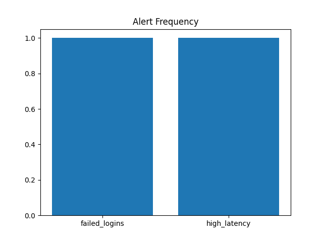

# Cloud Log Analyzer

Analyze JSON log files and automatically generate alerts and summary charts.  
This project simulates a lightweight log analysis and monitoring tool — ideal for cloud and SOC (Security Operations Center) environments. It detects failed logins, high latency requests and generates visual summaries.



---

## Table of Contents
- [Installation](#installation)
- [Usage](#usage)
- [Features](#features)
- [Sample Output](#sample-output)
- [License](#license)

---

## Installation

1. **Clone the repository**
```bash
git clone https://github.com/partz2510/cloud-log-analyzer.git
cd cloud-log-analyser
```


2. **Create a virtual environment and activate it**
 ```bash
python -m venv venv
venv\Scripts\activate
```


3. **Install dependencies**
```bash
pip install -r Logs/Requirements.txt
```

## Usage

**To analyze your log files and generate summary reports**
 ```bash
python Cloud_log_analyzer.py --logs Logs/sample_log.json --out output
```


This will:

1.Parse the JSON log file

2.Detect failed logins and high-latency events

3.Export alerts to output/alerts_summary.csv

4.Generate a visualization chart in output/summary_bar.png


## Features

🚨 Detect failed login attempts automatically

⚡ Highlight high-latency requests

📊 Generate CSV summaries of alerts

📈 Create visual charts for quick analysis

💾 Fully automated log parsing and reporting


## Sample Output

After running the script, you’ll find the following files in your output folder:	

1.Detailed summary of detected alerts , 'Alerts_Summary.csv'

2.Visualization of log categories and event counts , 'Summary_Bar.png'


## License
This project is licensed under the MIT License.


💡 Author
Parthiban Ganesan

GitHub: partz2510

Project: Cloud Log Analyzer

## 🔍 Splunk Integration

This project now includes a Splunk dashboard and sample saved searches for visualizing cloud log analytics data.

**Folder structure**
- `splunk/dashboards/` – XML dashboards
- `splunk/savedsearches/` – prebuilt searches (SPL)
- `splunk/data_inputs/` – log source setup examples

To test locally:
1. Import the XML under Splunk > Dashboards.
2. Load logs into index `cloud_logs`.
3. Explore trends and error distribution in real time.
